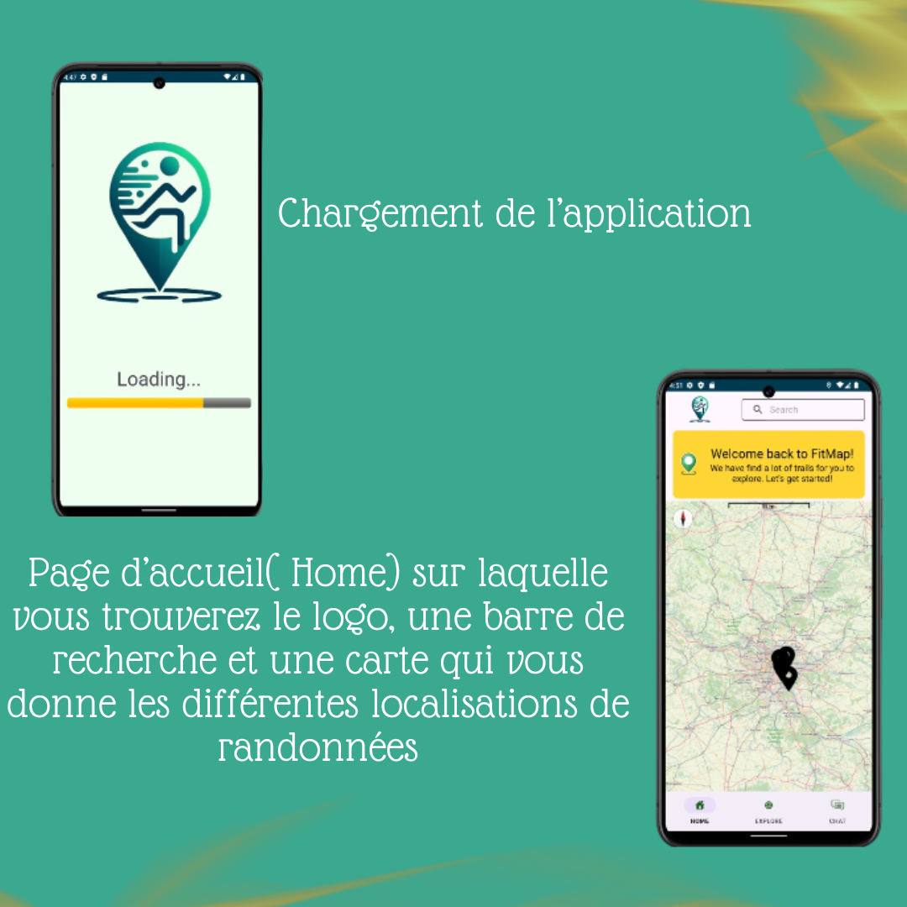
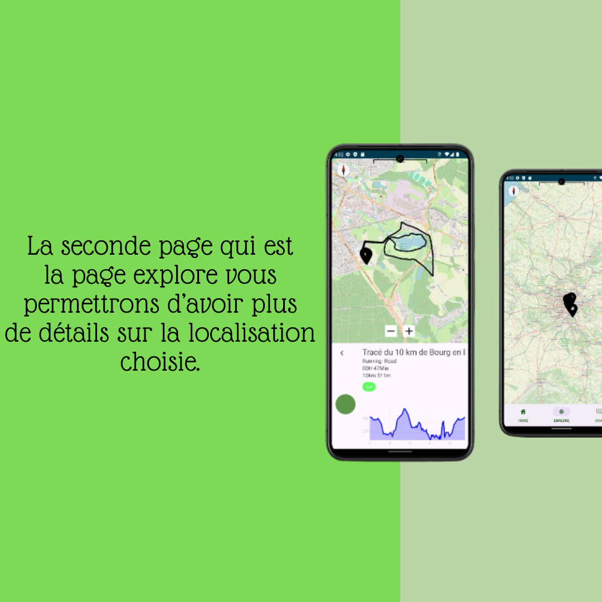

# Projet FITMAP - Application de sortie sportive

## Description
L'application FitMap est une application de sortie sportive qui permet à l'utilisateur de trouver des routes de course à pied, de vélo ou de marche à proximité de sa position. L'utilisateur pourra également suivre les traces GPS en temps réel.

Un système de chat est également disponible pour permettre aux utilisateurs de discuter entre eux ainsi que de se partager des images et activités sportives.

# Capture d'écran

## Fonctionnalités
- Chargement d'activités sportives depuis l'API OpenRunner
- Affichage des activités sportives sur une carte OpenStreetMap
- Suivi en temps réel de sa position GPS
- Affichage de son parcours en temps réel sur la carte
- Système de connection et d'inscription, sauvegardé sur Firebase
- Système de chat entre utilisateurs (Fonctionnalité en cours de développement)
- Système de partage d'activités sportives (Fonctionnalité en cours de développement)
- Système de partage d'images (Fonctionnalité en cours de développement)

## Technologies et logiels utilisées
- Android Studio
- Java
- Firebase
- OpenStreetMap/OSMDroid
- OpenRunner API

## Installation
1. Cloner le projet
2. Ouvrir le projet avec Android Studio
3. Configurer une VM Android
4. Lancer le projet
    
    Pour avoir accès à la localisation GPS, il est nécessaire de configurer une VM Android avec une localisation GPS. Pour cela, il faut :
    - Ouvrir le menu de la VM (les trois points en haut à droite de la VM)
    - Choisir "Location"
    - Selectionner un point sur la carte
    - Cliquer sur "Set Location"

## Auteurs
- ROCHE Guillaume
- NDE NOUMI Steve Darius
- DAMKAM Milaine